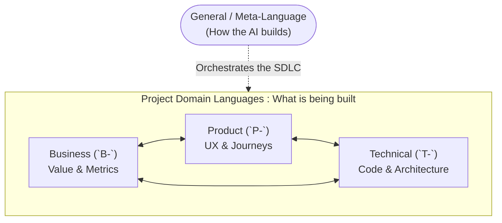

# AI Pattern Language

This directory contains a living "Pattern Language" (inspired by Christopher Alexander) designed to guide AI agents in running a software business - business design, product design, and technical design.

## The Patterns

“Each pattern describes a problem which occurs over and over again in our environment, and then describes the core of the solution to that problem, in such a way that you can use the solution a million times over, without ever doing it the same way.”

## The Connection Between the Patterns

* ordered in spatial scale: from towns Independent Regions (1) to the photos on your wall Things From Your Life (253)
* each pattern helps to complete the patterns connected to it; no pattern is an isolated entity; all are part of a larger ‘whole’
* reading “up and “down” through the patterns will give you a sense of which ones are needed for your project

## Confidence

The confidence tags reflects the author’s belief that the solution is “correct”.

* High confidence (***) means that “the solution stated summarizes a property common to all possible ways of solving the stated problem.”
* Medium confidence (**) means that some progress has been made but improvements should be sought through experimentation.
* Low confidence (*) means that there are definitely other ways of solving the problem that aren’t written and that at least a single solution is described as a starting point.

## Why a Pattern Language for AI?
AI agents are effectively unbounded intelligences operating across vast, complex spaces of decision-making. In many ways, they face the exact same architectural challenges as human engineers. Christopher Alexander's structural concept is a perfect fit for guiding AIs because it provides:

- **Context Window Efficiency (Lazy Loading):** Patterns are highly modular and cross-linkable. An AI can read a high-level master index and dynamically traverse only the specific markdown files required for its immediate task, gaining profound context without blowing its token limit.
- **Continuous Scale:** The language seamlessly maps relationships from high-level abstractions down to tiny implementation details. This ensures an AI working on a low-level technical problem understands exactly how its work impacts the broader product and business visions.
- **Guided Creativity via Constraints:** By documenting the competing "Forces" behind a problem and using confidence rankings (`*` vs `***`), patterns provide structured, "soft" constraints. This empowers agents to creatively navigate edge-cases and competing requirements while remaining rigidly aligned to the project's holistic vision.

## Domain Indices (`INDEX.md`)
A core tenet of Christopher Alexander's framework is an index that groups patterns by section alongside brief explanations. 

Instead of an AI blindly listing directory contents to guess what a pattern does, each domain folder (`.agents/skills/ai-pattern-language/general/`, `pattern-languages/business/`, `pattern-languages/product/`, `pattern-languages/technical/`) maintains its own `INDEX.md` file. An AI should **always read the relevant `INDEX.md` first**. These indices provide a 1-sentence summary of each pattern within that domain, allowing an AI to immediately grasp the available architectural decisions.

Whenever a new pattern is created or an existing one is updated, **the corresponding `INDEX.md` must be updated** to reflect the change.

### Visual Overview: Meta vs Domain Patterns

## 1. Generalized "Pattern Language" for AI-Driven Development (`.agents/skills/ai-pattern-language/general/`)

**The Meta-Language:** These patterns are a guide on *how to leverage AI to build software*. They are completely independent of any specific project's source code.

These universal patterns define how the AI should approach the SDLC process itself: how to orchestrate architecture decisions, how to use specific diagramming tools, and how to balance business/product/technical concerns. This directory is a meta-framework that recursively self-improves your own AI development process.

Note that even this "general" Pattern Language is intended to be very opinionated. Every strong framework inherently has trade-offs, and as such different people may evolve very different "Pattern Languages" for their particular philosophy of software development. The key is that the Pattern Language should be a clear, concise, and actionable guidebook for the AI agent.

**Core Philosophy:** The underlying philosophy driving *this* specific pattern language is documented in [`general/PHILOSOPHY.md`](general/PHILOSOPHY.md).

**File Naming:** Use the `G-` prefix and an incrementing number (e.g., `G-001-architecture-diagrams.md`).

## 2. Project-Specific Pattern Languages (`pattern-languages/`)

**The Project Domain:** While the general patterns teach the AI *how* to build, these project-specific patterns define *what* is being built.

These pattern languages are tailored exclusively to this local repository. They reference the `general/` patterns but apply strict constraints to document this project's unique tech stack, business logic, UX rules, and historical decisions. You will spend the vast majority of your time creating and editing patterns in these directories, as they form the living architecture of the specific software you are building.

Crucially, the project's three pattern languages are interwoven. Each domain contains its own scale (from high-level abstraction to tiny details) and cross-references the others extensively. The relationship between these domains is defined by the core philosophy of the pattern language (see `general/PHILOSOPHY.md`).

- **`pattern-languages/product/`**: **Prefix: `P-`** (e.g., `P-001-frictionless-onboarding.md`). These cover UX, user journeys, design systems, and the core problem-solution fit.
- **`pattern-languages/business/`**: **Prefix: `B-`** (e.g., `B-001-freemium-conversion.md`). These cover monetization, target audience, KPIs, and value propositions that sustain the product.
- **`pattern-languages/technical/`**: **Prefix: `T-`** (e.g., `T-001-optimistic-ui-update.md`). These cover architecture, state, APIs, databases, and how the software brings the product to life.

### The Interconnected Graph
Domains do not exist in a pure linear hierarchy. To ensure AI agents understand the "Why" behind their decisions, they must explicitly document lateral cross-domain links when writing new patterns:
- A high-level **Business decision** (Monetization Strategy) can directly depend on a low-level **Technical capability** (Secure Local Storage).
- A low-level **Technical rule** (Optimistic UI Updates) only exists to serve a mid-level **Product rule** (Frictionless Onboarding).

By linking deeply across domains, the graph of context is maintained.

## Continuous Evolution (A Living Document)
These patterns are not static rules written in stone. They form a living organism meant to evolve continuously alongside the project. Finding a bug or hitting a dead-end is not a failure; it is fuel for the framework.
- **Iterate and Extend**: When an AI agent or human engineer discovers a new architectural requirement, resolves a complex trade-off, or learns from a dead-end, they must perpetually abstract their learnings out of ephemeral chat logs and codify them by **drafting a new pattern** or **updating an existing one**, and recording it in the corresponding domain's `INDEX.md`.
- **The Engine of Improvement**: This folder acts as the central mechanism for recursive self-improvement across the entire SDLC.

## Bootstrapping Patterns
If you are starting on a new project, you can run the bootstrap workflow to generate the initial set of project-specific patterns based on the existing codebase:
`/slash-command bootstrap-project-patterns` (or run it from `workflows/bpt/bootstrap-project-patterns.md`).

## Analyzing & Reorganizing Patterns
As your pattern language grows, it can become structurally messy. We provide two commands for recursive self-improvement:

1. **Internal Organization:** To analyze a *single* pattern language (e.g., just `technical/` or just `general/`) to ensure patterns are ordered correctly by Scale, Domain, and Complementarity:
   `/slash-command analyze-pattern-organization [path/to/folder]`
2. **Cross-Domain Alignment:** To structurally review a specific software project and ensure the Business, Product, and Technical domains are respecting boundaries and cross-linking correctly:
   `/slash-command analyze-bpt-alignment`
3. **Editorial Review:** To enforce strict editorial standards, conciseness, and link-validity on a single specific pattern:
   `/slash-command review-pattern [path/to/pattern.md]`
