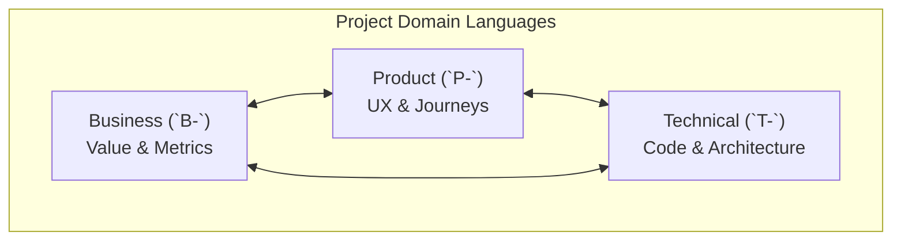

# BPT Software Scaffolding
This skill is highly opinionated. It asserts that every software project must be separated into three distinct but complementary pattern languages: Business, Product, and Technical. 

## The Triad Domains

Crucially, the project's three pattern languages are interwoven. Each domain contains its own scale (from high-level abstraction to tiny details) and cross-references the others extensively.

- **`pattern-languages/product/`**: **Prefix: `P-`** (e.g., `P-020-frictionless-onboarding.md`). These cover UX, user journeys, design systems, and the core problem-solution fit.
- **`pattern-languages/business/`**: **Prefix: `B-`** (e.g., `B-020-freemium-conversion.md`). These cover monetization, target audience, KPIs, and value propositions that sustain the product.
- **`pattern-languages/technical/`**: **Prefix: `T-`** (e.g., `T-040-optimistic-ui-update.md`). These cover architecture, state, APIs, databases, and how the software brings the product to life.

### Visual Overview

### The Interconnected Graph
Domains do not exist in a pure linear hierarchy. To ensure AI agents understand the "Why" behind their decisions, they must explicitly document lateral cross-domain links when writing new patterns:
- A high-level **Business decision** (Monetization Strategy) can directly depend on a low-level **Technical capability** (Secure Local Storage).
- A low-level **Technical rule** (Optimistic UI Updates) only exists to serve a mid-level **Product rule** (Frictionless Onboarding).

By linking deeply across domains, the graph of context is maintained.

## The Engine Dependency
This skill defines *how* an application should be architected (BPT), but it does not define *how* a pattern language physically operates. 

The 3 patterns languages are intended to be self-improving through repeated use of the **pattern-language-engine** skill (from https://github.com/apinstein/skills/blob/main/pattern-language-engine/SKILL.md) to actually template, index, and organize the physical markdown files that make up the BPT domains. 

## Workflows
- **`bootstrap-project-bpt.md`**: Seeds a software repository with the BPT structure.
- **`analyze-bpt-alignment.md`**: Audits an existing software repository to ensure the three domains are maintaining proper scale alignment and complementary cross-links.
