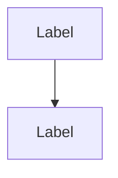

# [ID]: [Pattern Name] [Confidence Tag]
*(Note: The filename must start with this exact ID, e.g., `[ID]-[pattern-name].md`)*
*(Note: Confidence Tag must be `**` for a true invariant, `*` for some progress towards an invariant, or no asterisk for a starting point)*

**Status:** [Draft | Active | Deprecated]
**Type:** [General | Project]
**Domain:** [Business | Product | Technical]

*(Insert an archetypal picture or diagram that sets the context here)*

## Context
[An intro paragraph setting the context by explaining how this pattern helps complete certain larger patterns. E.g., How does this relate to other domains or higher-level structural rules?]

⋇ ⋇ ⋇

## Problem
[A concise, 1-2 sentence statement of the core problem or essence of the problem.]

### Body of Problem
[What makes this problem difficult? Detailed explanation of the forces, context, and tensions at play.]

## Solution
[The heart of the pattern, always stated in the form of a direct instruction.]

### Solution Diagram
*(Insert a diagram showing the solution with labels on main components)*

### Body of Solution
[Detailed explanation of the solution, the rationale, and the concrete implementation steps or code examples.]

⋇ ⋇ ⋇

## Related Smaller Patterns
[A paragraph that ties the pattern to related smaller patterns. Link DOWN to smaller-scale patterns the AI should use to embellish or implement the details of this solution.]
